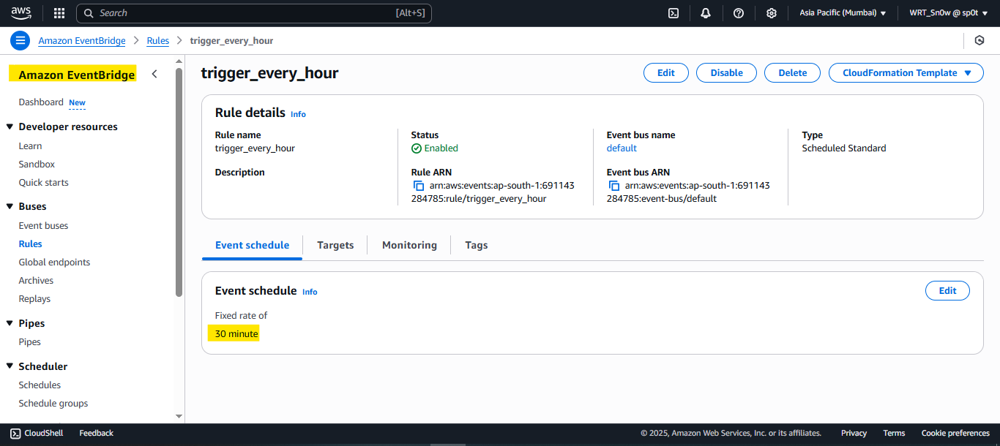
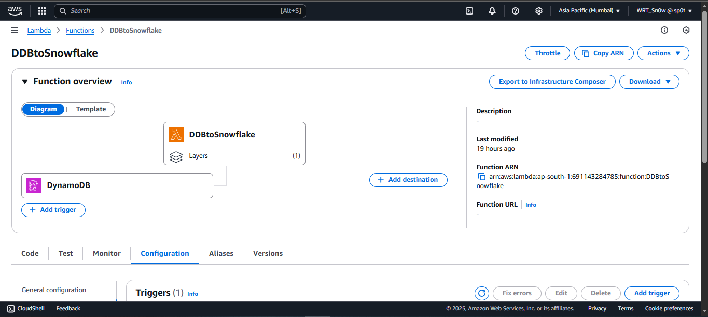
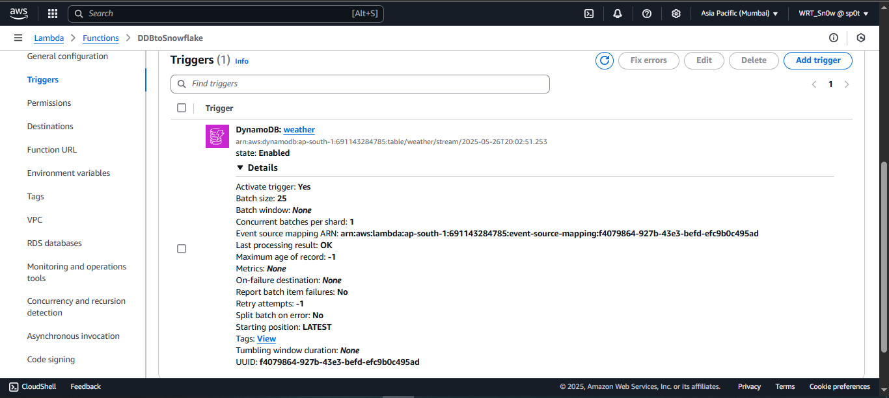
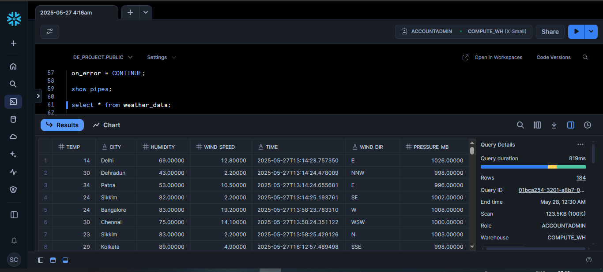

# 🌦️ WeatherStream: Real-Time ELT Pipeline using AWS and Snowflake ❄️

Welcome to WeatherStream! This project showcases an automated, serverless system for capturing live weather data, processing it efficiently, and loading it into a Snowflake data warehouse for real-time analytics. It's designed to be reliable, scalable, and cost-effective.

---

## 🗺️ Architectural Overview: The Big Picture

WeatherStream's architecture is crafted for an efficient, end-to-end journey of real-time weather data. It begins with data extraction from a public API, followed by processing using serverless AWS services, and culminates in loading into Snowflake for powerful analytics. The diagram below visually outlines this entire process:

*The complete data pathway: API → DynamoDB → Lambda → S3 → Snowpipe → Snowflake.*

---

## ⚙️ How It Works: The Data Journey, Step-by-Step

WeatherStream operates through a clear, automated sequence:

1.  **📡 Step 1: Fetching Live Weather Data**
    *   A Python script ([Fetch_WeatherAPI.py](Fetch_WeatherAPI.py)) automatically retrieves the latest weather information from a public API.
    *   This process is scheduled and triggered by **AWS EventBridge**, ensuring consistent data collection.
        *   *EventBridge Schedule:*
            
    *   The raw data is immediately stored in **AWS DynamoDB**, a fast and flexible NoSQL database.

2.  **🔄 Step 2: Processing and Preparing Data**
    *   Whenever new data arrives in DynamoDB, it triggers an **AWS Lambda function** (implemented by [DDB2Snowflake.py](DDB2Snowflake.py)) via DynamoDB Streams.
        *   *Lambda Function Setup:*
            
        *   *Lambda Trigger (from DynamoDB):*
            
    *   This Lambda function processes the data (e.g., cleans, formats) and then exports it to **Amazon S3**, an object storage service, preparing it for the data warehouse.

3.  **❄️ Step 3: Loading into Snowflake for Analysis**
    *   **Snowpipe**, Snowflake's continuous data ingestion service, automatically detects new data files in the S3 bucket.
    *   It efficiently loads this processed data into our **Snowflake Data Warehouse**.
    *   Inside Snowflake, SQL scripts ([Snowflake.sql](Snowflake.sql)) transform and model the data, making it ready for analysis and reporting.

---

## 🛠️ Core Technologies at Play

WeatherStream leverages these key services and tools:

*   **Data Source:** Public Weather API
*   **Extraction & Scheduling:** Python ([Fetch_WeatherAPI.py](Fetch_WeatherAPI.py)), AWS EventBridge
*   **Initial Storage:** AWS DynamoDB
*   **Processing:** AWS Lambda (using [DDB2Snowflake.py](DDB2Snowflake.py)), DynamoDB Streams
*   **Staging Storage:** Amazon S3
*   **Data Warehousing & Ingestion:** Snowflake, Snowpipe
*   **Transformation:** SQL ([Snowflake.sql](Snowflake.sql))

---

## ✨ Key Advantages of WeatherStream

*   ⏱️ **Real-Time Insights:** Access and analyze weather data almost as it happens.
*   ☁️ **Fully Serverless:** No servers to manage, reducing operational overhead and cost.
*   🔁 **Automated Pipeline:** Data flows automatically from source to analytics.
*   📈 **Scalable by Design:** Easily handles growing amounts of data.
*   💰 **Cost-Effective:** Pay-as-you-go model optimizes cloud spending.

---

##📊 Seeing is Believing: Sample Data & Dashboard

*   **Raw Data Samples:**
    *   S3 Staged Data: [S3_Weather_Data_2025-05-27_13-14-23.csv](S3_Weather_Data_2025-05-27_13-14-23.csv)
    *   DynamoDB Initial Data: [DDB_results.csv](DDB_results.csv)
*   **Analytical Output:**
    *   Snowflake Data Warehouse Dashboard – Visualizing the weather trends:
        

---

## 📜 License

This project is licensed under the MIT License. You can find more details in the [LICENSE](LICENSE) file.

---

## 🧑‍💻 Author

Developed with dedication by **Subhajit Chowdhury © 2025**.

---

Hope this provides a clear and engaging overview of WeatherStream. Dive in and explore the power of real-time data!
