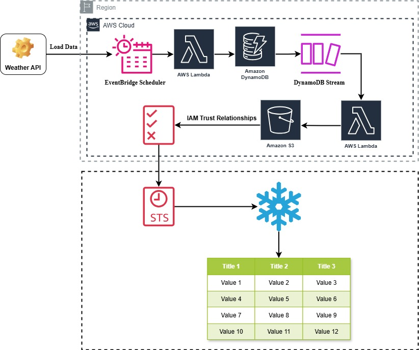

# WeatherStream: Real-Time ELT Pipeline using AWS and Snowflake

A fully serverless, real-time ELT (Extract, Load, Transform) pipeline that ingests live weather data from a public API into AWS DynamoDB, processes it through AWS Lambda, and loads it into Snowflake using Snowpipe.

## Project Architecture

## Components

### 1. Data Extraction
- Python script ([Fetch_WeatherAPI.py](Fetch_WeatherAPI.py)) fetches real-time weather data from a public Weather API
- Automated data loading into AWS DynamoDB
- Scheduled data loads configured through AWS EventBridge

### 2. Data Processing & Storage
- AWS DynamoDB serves as the initial data store
- AWS Lambda function ([DDB2Snowflake.py](DDB2Snowflake.py)) triggers on DynamoDB updates
- Processed data is automatically exported to Amazon S3

### 3. Data Warehousing
- Snowflake integration using Snowpipe for real-time data ingestion
- Data transformation and modeling using SQL ([Snowflake.sql](Snowflake.sql))
- Analytics-ready data warehouse structure

## Pipeline Flow
1. Weather API data extraction via scheduled EventBridge trigger
2. Initial data storage in DynamoDB
3. Lambda function processes DynamoDB streams
4. Processed data exported to S3
5. Snowpipe automatically loads data into Snowflake
6. Data transformation and analytics in Snowflake

## Key Features
- Real-time data processing
- Fully serverless architecture
- Automated data pipeline
- Scalable infrastructure
- Cost-effective solution

## Sample Data
- Sample weather data: [S3_Weather_Data_2025-05-27_13-14-23.csv](S3_Weather_Data_2025-05-27_13-14-23.csv)
- DynamoDB sample results: [DDB_results.csv](DDB_results.csv)

## Visualization
- Snowflake Data Warehouse Dashboard: [SF_DWH_Result_Dashboard.png](SF_DWH_Result_Dashboard.png)

## Project Documentation
- Lambda Function Configuration: [DDB2SF_Lambda_Function.png](DDB2SF_Lambda_Function.png)
- Lambda Trigger Setup: [DDB2SF_Lambda_Function_Trigger.png](DDB2SF_Lambda_Function_Trigger.png)
- EventBridge Configuration: [AWS_EventBridge.png](AWS_EventBridge.png)

## License
This project is licensed under the MIT License - see the [LICENSE](LICENSE) file for details.

## Author
Subhajit Chowdhury © 2025
